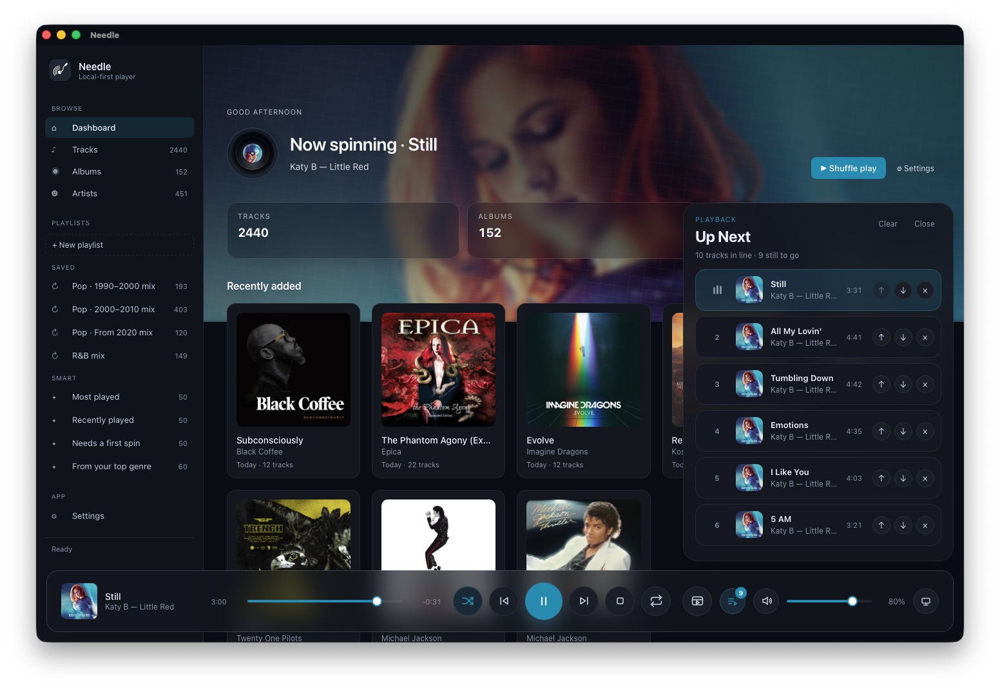

# Needle

A local-first, hi-fi music player for macOS built with **Tauri**, **React + TypeScript**, and **Rust**. Audio playback is handled by **mpv** through its JSON IPC, so lossless formats (FLAC, ALAC, WAV, AIFF) sound exactly the way they should.

> Status: actively usable local-first player — library, queue, saved playlists, playback persistence, equalizer, and richer library curation tools are all in place, with smarter playlisting and metadata refinement continuing to grow.



## Features

### Library
- **Local library** stored in SQLite under the OS app-data directory
- **Folder import** with recursive scan of FLAC, ALAC, WAV, AIFF, M4A, AAC, MP3, OGG, Opus
- **Tag extraction** via `lofty`: title, artist, album, track number, **genre**, **year**, **BPM**, sample rate, bit depth
- **On-demand MusicBrainz album refresh** from the album page right-click menu when an imported release needs cleaner metadata
- **Hidden files ignored** — dotfiles and dot-directories are skipped during scan
- **Maintenance command** rescans your folders for changes and purges any dotfile entries from the library (never touches your audio files), with live Settings progress output and a recorded last-run timestamp
- **Diff-based rescans** preserve `added_at` and play history across maintenance runs
- **Per-folder removal** from Settings

### Dashboard
- **Time-of-day greeting** with library summary, or a **Now spinning** hero when something's playing
- **Hero now-playing treatment** with an animated vinyl indicator, center-label album art, and album artwork stretched across the top dashboard band
- **Idle dashboard backdrop** from bundled artwork when nothing is playing, so the hero stays readable instead of falling back to empty white space
- **Quick actions**: Shuffle play · Add folder
- **Recently added albums** sorted by newest tracks with relative timestamps (Today / 3d ago / 2w ago…)
- **From your library** row grounded in your own listening history and collection metadata:
  - **Favourites** from the heart-marked tracks you explicitly saved
  - **Top rated** from the stars you assign yourself
  - **Most played** & **Recently played** from real play history
- **Featured albums** & **Top artists** rows
- **Library signatures** row that turns your strongest decade + genre pockets into smart mixes such as `2000s Pop` or `1990s Rock`
  - signature tiles reflect the full matching library pocket while their 50-track playlists stay album-balanced so one record cannot dominate the mix
- **Vibe row** with four BPM-informed smart mixes:
  - **Wind down** for slower songs that help the room exhale
  - **Cruise & groove** for easy motion and warm rhythm
  - **Lift & energy** for brighter momentum
  - **Get on your feet** for the songs that make stillness unlikely
- **Quick picks** — random tracks playable in one click

### Playback
- **mpv backend** for bit-perfect lossless playback through JSON IPC
- **Real Up Next queue** with visible current item, album covers, queue counts, and click-outside dismiss
- **Fast-opening Up Next queue** with deferred album-art loading so large queues stay responsive
- **Queue actions everywhere they matter**: Play next · Add to queue · album-level Play next / Add to queue
- **Queue editing**: reorder, remove individual items, clear upcoming tracks, direct jump to any queued track
- **Queue-aware playback**: play album · shuffle artist · play all Quick picks · shuffle a From-your-library playlist — mpv auto-advances through the queue
- **Playback persistence** restores queue, selected track, repeat mode, shuffle state, and last position between launches
- **Safe relaunch behavior** restores the last session in a stopped state, never surprise-autoplays on app launch
- **Backend offline mode** now switches automatically when the homeserver becomes unreachable, keeps the regular dashboard UI, hides online-only actions, and shows only downloaded tracks for offline playback until the backend comes back
- **Automatic backend reconnect** checks run quietly in the background, so backend mode can move between online and offline without needing a manual Settings health check
- **Repeat modes**: off · one · all
- **Shuffle state** is visible and persistent
- **Artwork-first mini player** with full-bleed cover art, drag-to-move behavior, pinned always-on-top mode, and an expandable / resizable Up Next queue
- **Hover ▶ on the dashboard**: album cards (Recently added & Featured), artist tiles, and a "Play all" button on Quick picks
- **Per-track play counts** and `last_played_at` recorded automatically
- **Per-track favourites** saved locally with a heart toggle, separate from star ratings
- **Per-track user star ratings** saved locally and reusable across the app
- **Opt-in volume leveling** based on local FFmpeg loudness analysis, with gentler per-track gain applied through mpv while leaving your main listening volume untouched
- **Now-playing bar** with cover, metadata, transport controls, seek/progress scrubbing, volume + mute, and output-device selection — synced to actual mpv track changes during queue playback
- **Safer startup volume** defaults to 80% to reduce surprise-blast playback on first launch
- **Animated current-track indicator** in both the main track list and the album track list
- **Robust shutdown**: mpv is killed whenever the app exits via Drop, Tauri's exit event, *and* a SIGINT/SIGTERM/SIGHUP handler — with a `pkill` fallback so playback can never outlive the app
- Album art
  - sidecar files first: `cover.{jpg,png,webp}`, `folder.*`, `front.*`, `album.*`, `albumart.*`, `artwork.*`
  - falls back to embedded artwork via `lofty`
  - cached in-memory on the frontend
  - broad browsing surfaces now prefer throttled / deferred cover loading so Albums, Tracks, and Dashboard stay responsive even in large libraries

### Playlists
- **Sidebar Playlists section** with saved playlists and smart playlists
- **Manual playlists** stored in SQLite and editable in-app
- **Auto-updating filtered playlists** can save the current Tracks search + filter state (artist, genre, year range, query) and refresh themselves when your library changes
- **Empty playlist creation** directly from the sidebar
- **Add to playlist** actions on tracks and albums, with in-app creation of a new playlist during the add flow
- **Playlist pages as playback views** with top-level Play / Shuffle / Play next / Add to queue actions
- **Save visible track sets** from the Tracks view or album pages as playlist snapshots
- **Filtered playlist creation** from library metadata such as artist and genre
- **Playlist management**: rename, delete, reorder tracks, remove tracks
- **Smart playlists** surfaced as first-class library views generated from your collection and listening history
- **Favourites smart playlist** automatically keeps a heart-marked mix in sync with your library
- **Ratings-driven smart playlist** automatically keeps a `Top rated` mix in sync with your own stars
- **Library-signature smart playlists** derive decade + genre mixes from the depth and diversity of your own collection, then round-robin albums so shuffle play stays varied
- **Smart-playlist genre focus pills** let you narrow a generated mix to the genres currently present in that playlist, including multi-select combinations like pop + r&b
- **Embedded-BPM vibe playlists** quietly map tempo into mood buckets instead of turning the library into a wall of raw numbers

### Artist portraits & bios
- **Artist portraits** pulled for free via **MusicBrainz → Wikidata → Wikimedia Commons**
- **Artist biographies** pulled via **MusicBrainz → Wikidata → Wikipedia** when linked metadata is available
- **Artist gender enrichment** pulled from **MusicBrainz** when the artist record exposes it, giving artist-radio and other metadata-driven features a useful extra signal for solo acts
- **Artist photo fallback chain** now checks direct MusicBrainz image relations, Wikidata `P18`, and finally the linked Wikipedia page image when available
- **Artist info fallback chain** now keeps MusicBrainz gender whenever available, prefers Wikipedia summaries for bios, falls back to Wikidata descriptions when needed, and avoids wiping a previously good portrait or bio on a failed manual refresh
- **Collaboration artist credits** such as `Artist A & Artist B` now fall back to individual credited artists when the combined string does not exist as a standalone MusicBrainz artist
- No API keys required; polite User-Agent + 1 req/sec serialization
- Cached in SQLite (`artist_images`) for 30 days, including misses so we don't keep hammering the API
- Cached in SQLite (`artist_info`) for 90 days on successful lookups, while empty misses expire quickly so transient upstream failures do not stick around for months
- **Artist-page recovery tools** are hidden behind a right-click menu on the hero portrait for Refresh photo / Refresh bio, with loading feedback during background refreshes
- **Backend-mode custom artist photos** can be uploaded from that same right-click portrait menu when automatic enrichment picks a poor image, and you can switch back to the automatic source later without leaving the artist page
- **Graceful artwork fallback** uses the artist's album art across the artist page and Artists browser before falling back to a gradient initial when no portrait loads
- **Artists browser performance** favors cached portraits and lazy offscreen loading so large artist grids feel fast without hammering remote lookups up front

### Views
- **Dashboard** (default landing screen)
- **Tracks** with live search, sorting, and filters for artist / genre / year range, plus album / artist / playlist context
- **Normalized genre filters** collapse casing and common formatting variants into one clean vocabulary, so `Pop`, `pop`, and similar duplicates do not fragment browsing
- **Compact BPM details** on track rows, album pages, and artist pages, with a click-to-open editor for set / edit plus quick halve / double actions
- **Tap-tempo BPM helper** inside the BPM editor lets you tap `Space` or click along with the current song to estimate a BPM before saving it
- **BPM sanity check** in Settings under Maintenance with a review queue for suspicious tempo tags and missing BPMs, inline halve / double fixes, playback-assisted review mode, bulk suggestion apply, and “mark intentional” dismissals for false positives
- **Album-aware BPM confidence scoring** can identify strong half/double-time spikes against an album's median tempo and offer best-effort high-confidence auto-fixes
- **Albums** with cover art, sorting, direct playlist actions, and album-wide genre editing
- **Large library browsers** lazily load offscreen covers / portraits and stage media work near the viewport instead of trying to resolve every image at once
- **Album detail page** with hero artwork, metadata, play/shuffle actions, multi-disc track grouping, editable primary genre, artist deep links, and background album info when available
- **Vinyl-rip badge support** detects `vinyl-rip` tags from your files and marks matching albums with a small record badge on album artwork
- **Artists** with sorting, live search, list/grid display toggle, album-artist or all-artist browsing, album + track counts, dedicated artist pages, release-year-sorted album grids, most-played-track actions, inline bio actions, and photo-context refresh tools
- **Settings** with theme switcher, custom accent color, library folders, passive watched-folder health hints, maintenance with live progress + last-run info, loudness analysis with live progress output, structured progress counts, failed-file review/copy tools, live equalizer presets, manual 10-band EQ, an in-app backend version readout, and a metadata save-mode switch for `Needle only` vs `Write to files`
- **Needle backend setup and migration prep** in Settings: choose `Local folders` or `Needle backend`, verify backend health, configure the backend URL plus Needle account credentials, and migrate playlists, favourites/history, metadata caches, loudness-analysis data, and shared playback session state into the backend

### Album info
- **Background album notes** pulled via **MusicBrainz release-group → Wikidata → Wikipedia**
- **Album metadata refresh** can match one album at a time against **MusicBrainz release** data and refine track titles, album artist, disc / track numbering, and year without rescanning the whole library
- **Metadata refresh is opt-in and non-destructive**: Needle stores local overrides only for albums you explicitly refresh, while the original imported file tags remain preserved underneath
- Artist-aware album matching improves lookups for releases with ambiguous or very common titles
- Collaboration credits on album artists now try split candidates as well, so releases like `Artist A & Orchestra B` can still resolve to the correct MusicBrainz release group
- Subtitle-aware fallback matching now also trims common edition markers after separators like `:` / `-`, and can fall back from long parenthetical subtitles to the core album title when MusicBrainz files the release more tersely
- When a release group has no linked Wikipedia or Wikidata page, Needle now falls back to a simple factual note from MusicBrainz itself instead of leaving the album page blank
- Cached in SQLite (`album_info`) so repeat opens are instant and we avoid repeat lookups
- **Album page genres** are derived from the effective per-track genre tags Needle is using, whether they come straight from the files or from Needle-only edits
- **Album-wide genre editing** can either stay local to Needle or write directly into the music files, depending on your Settings preference
- **Searchable album-genre picker** speeds up metadata cleanup with reusable library genres, pill-style multi-select editing, and quick creation of new genres when needed
- **Refresh failures are now surfaced clearly** when MusicBrainz is temporarily rate-limiting or unavailable, so you get a friendly “try again later” message instead of a cryptic backend error
- Graceful fallback when no article exists for obscure releases, compilations, or local-only metadata

### Themes & UX
- **Themes**: System, Light, Dark
- **Custom accent color** persisted in SQLite and applied across playback controls, queue highlights, buttons, and selection states
- **Theme-aware branding** with separate light/dark app icons and a dock-tuned macOS icon set
- **Top-right toast notifications** now surface success, warning, and error states in a clear app-level notification card instead of hiding transient messages in the sidebar footer, with success confirmations auto-dismissing after a short delay
- **Mini player runtime dark override** keeps the compact artwork-first window in a dark presentation without changing the user's saved theme preference
- **Wikipedia links** from album and artist metadata open in the system browser instead of relying on webview behavior
- **Equalizer presets** wired through **mpv** audio filters: Flat, Bass Boost, Bass/Treble Boost, Vocal, Treble Boost, Lounge
- **Manual 10-band EQ** with preset curve visualization; manual slider edits are applied on release to avoid playback stutter

## Architecture

```
┌──────────────────────────┐         IPC         ┌──────────────────────┐
│ React + TS frontend      │◀──── Tauri ────────▶│ Rust backend         │
│  - Dashboard / views     │                     │  - SQLite library    │
│  - Queue + playlists     │                     │  - Folder scanner    │
│  - Cover art hook        │                     │  - Cover extractor   │
│  - Player controls       │                     │  - Play history      │
│  - Session restore       │                     │  - Playlist storage  │
└──────────────────────────┘                     │  - mpv controller    │
                                                 └──────────┬───────────┘
                                                            │  Unix socket
                                                            ▼
                                                       ┌─────────┐
                                                       │  mpv    │
                                                       └─────────┘
```

### Key files

- `src/App.tsx` — UI, layout, routing-by-state
- `src/lib/tauri.ts` — typed wrappers around all Tauri commands
- `src/lib/cover.ts` — cover-art hook with module-level cache
- `src/lib/artistImage.ts` — artist portrait hook with module-level cache, refresh support, and album-art fallback behavior
- `src/lib/artistInfo.ts` — artist-info hook with module-level cache
- `src/lib/albumInfo.ts` — album-info hook with module-level cache
- `src/lib/playlists.ts` — auto-playlist generators from tags + heuristics
- `src/styles.css` — full theming + layout
- `src-tauri/src/lib.rs` — Tauri command surface, app setup, and native external-URL opening
- `src-tauri/src/db.rs` — SQLite schema, migrations, library/playback persistence, saved playlists, artist-image cache, artist-info cache, album-info cache, and metadata edit preferences / overrides
- `src-tauri/src/library.rs` — folder scanner, dotfile filter, metadata via `lofty`
- `src-tauri/src/artist.rs` — MusicBrainz → Wikidata → Commons artist portrait lookup with Wikipedia image fallback, Wikipedia-backed artist biography lookup, and collaboration-credit fallback matching
- `src-tauri/src/album.rs` — MusicBrainz → Wikidata → Wikipedia album lookup with collaboration-credit matching and MusicBrainz factual fallback when no article is linked
- `src-tauri/src/album_metadata.rs` — on-demand MusicBrainz release matching for album-scoped metadata refreshes and local per-track overrides
- `src-tauri/src/mpv.rs` — IPC controller, spawns mpv with `--no-video --idle=yes`

## Requirements

- **Node.js** 18+
- **Rust** (stable) with the Tauri toolchain set up
- **mpv** installed and reachable

```bash
brew install mpv
```

The app will look for mpv at `/opt/homebrew/bin/mpv`, `/usr/local/bin/mpv`, `/opt/local/bin/mpv`, `/usr/bin/mpv`, then fall back to whatever `mpv` resolves to on `PATH`.

## Development

```bash
npm install
npm run tauri dev
```

Build a production bundle:

```bash
npm run tauri build
```

## Data locations

- **Library DB**: `library.sqlite` inside the OS app-data dir for the bundle id `com.davidrelich.needle`
- **mpv IPC socket**: `mpv.sock` in the same directory

On first launch after the rename from `Resonance`, Needle copies the existing database and SQLite sidecar files forward from the legacy app-data directory under `com.davidrelich.musicplayer`.

Maintenance and remove-folder actions only touch the database — your audio files are never modified or deleted.

## Backend transition status

Needle now supports a real desktop `Needle backend` mode in addition to `Local folders`.

What works today:

- backend URL, Needle username/password, and health checks in Settings
- desktop-to-backend migration for playlists, favourites/history, artist and album cache data, metadata overrides, loudness-analysis rows, and shared playback session state
- backend-backed library bootstrap in the Tauri app
- offline-safe backend startup that falls back to cached library data or downloaded tracks instead of failing on a blank screen when the homeserver is unavailable
- authenticated backend API access for bootstrap, playlists, metadata/state sync, and maintenance calls
- backend-backed playback while still keeping native `mpv` playback on desktop
- backend-mode loudness analysis from the desktop app, reusing offline downloads when present and falling back to backend streams when needed
- backend-mode album genre editing, including `Needle only` saves and backend file write-back when the server allows it
- backend-mode MusicBrainz album metadata refresh, using the existing desktop matcher against backend library tracks
- backend-owned artist photo and biography refresh in backend mode, with shared results stored once on the homeserver for every connected app
- backend-owned album notes refresh in backend mode, with shared album descriptions and source links stored once on the homeserver for every connected app
- selective offline downloads for backend-mode tracks and albums, with a local cache that playback prefers automatically
- backend-aware Settings UI with tabbed organization for `Library`, `Playback`, and `Appearance`

What this means in practice:

- `Local folders` remains the rich local-first mode
- the first Needle backend account is created from the web player on first launch, then reused by desktop clients
- `Needle backend` now loads the shared library, playlists, favourites, loudness data, and migrated cache data from the backend
- artist detail pages now auto-trigger a one-shot backend enrichment pass when the shared artist photo or biography is still missing, then repaint from the backend result when it arrives
- album detail pages now auto-trigger a one-shot backend enrichment pass when the shared album notes are still missing, then repaint from the backend result when it arrives
- protected backend APIs use the saved Needle credentials, while native `mpv` playback still pulls direct original media and artwork from the backend without a per-track login handshake
- backend mode now keeps desktop-only quality-of-life behavior such as dashboard artist-art fallbacks and shared MusicBrainz cleanup workflows closer to local-mode expectations
- native desktop listening features such as `mpv`, EQ, mini player, and deeper curation still stay on the desktop side

Still intentionally incomplete:

- backend-mode confidence checks still deserve more real-world use before treating the local desktop DB as fully optional
- download progress is currently batch-oriented rather than true byte-stream progress
- broader tag-contract alignment between desktop and backend is still being formalized

## Auto-playlists & metadata

Needle generates dashboard recommendations and smart-playlist views from data we already have, no machine learning required:

- **Play history** (`play_count`, `last_played_at`) drives Most played, Recently played, and Rediscover
- **User ratings** (`rating`) drive a `Top rated` smart playlist built from the stars you assign
- **Favourite flags** (`is_favorite`) drive a `Favourites` smart playlist built from the tracks you explicitly heart
- **Genre tags + year metadata** drive `Library signatures`, pairing strong decade + genre pockets from your own collection into album-balanced mixes
- **Embedded BPM tags** drive compact tempo details plus vibe buckets such as Slowdown, Cruise, Groove, Lift, Energy, and Chaos
- **Vibe playlists use those BPM buckets directly**, so tracks without BPM stay out of tempo-led mixes instead of being guessed into one
- **BPM editing** can stay local to Needle or write back to the embedded file tags, depending on the metadata save mode you choose in Settings
- **BPM sanity review** compares genre-family expectations with album-local BPM medians so obvious half/double-time spikes can be reviewed, bulk-applied, auto-fixed when confidence is strong enough, while tracks with no BPM tag are pulled into the same maintenance flow for manual review
- **Optional loudness analysis** stores LUFS / peak-derived gain data locally so Needle can level mixed queues when you enable volume leveling
- **Backend-mode loudness analysis** can scan either cached offline downloads or authenticated backend streams, so volume leveling still works while the library itself lives on Needle backend
- **Two-worker loudness scans** make the first analysis pass much more practical on modern Macs without overcommitting the whole machine
- **Version-aware loudness refresh messaging** calls out when a full-library rerun is expected because Needle upgraded its loudness-analysis method
- **Playlist-local genre focus** lets smart playlists keep their generated order while narrowing the current mix to one or more genres already represented in that playlist
- **Library state** (`play_count = 0`) drives Needs a first spin
- **Vinyl-rip tags** (for example `vinyl-rip`) can mark your own transfers visually without rewriting how Needle handles the rest of your metadata
- **Artist enrichment** (`gender` when MusicBrainz provides it) gives future artist-radio style mixes another optional signal without blocking playback when metadata is incomplete
- **`added_at`** (preserved across rescans) drives the Recently added albums row

Needle treats imported metadata as a starting point, not untouchable truth:

- **Raw embedded tags** stay preserved exactly as imported
- **Local overrides** can refine how the app interprets your library without modifying audio files
- **MusicBrainz album refresh** adds those overrides only for albums you explicitly choose to repair from the album page
- **Needle-only metadata edits** can refine browsing and filtering without modifying audio files
- **Write-to-file metadata edits** can make those same genre/BPM fixes visible to other music apps too

Needle already makes use of embedded BPM when your files provide it. A future opt-in analysis pass could still add missing BPM/key data for files that have none, or improve obviously broken source tags, but it is no longer required for vibe-aware smart playlists.

## Roadmap

- BPM + key analysis as an opt-in background step, with cached `audio_features` table
- EQ follow-ups such as per-album remembered curves and user-defined genre-to-preset suggestions/mappings, favoring opt-in guidance over unreliable auto-application
- Gapless playback hand-off
- Watch folders with incremental rescans
- Custom smart-playlist rules and editor
- Artist radio built from local genre/style context plus MusicBrainz artist enrichment
- Smarter sidecar handling (hidden FLAC metadata files, `.cue` sheets)
- Proper macOS / Windows / Linux icon set

## License

This project is licensed under the GNU General Public License v3.0. See [LICENSE](/Users/davidrelich/CascadeProjects/music-player/LICENSE).
